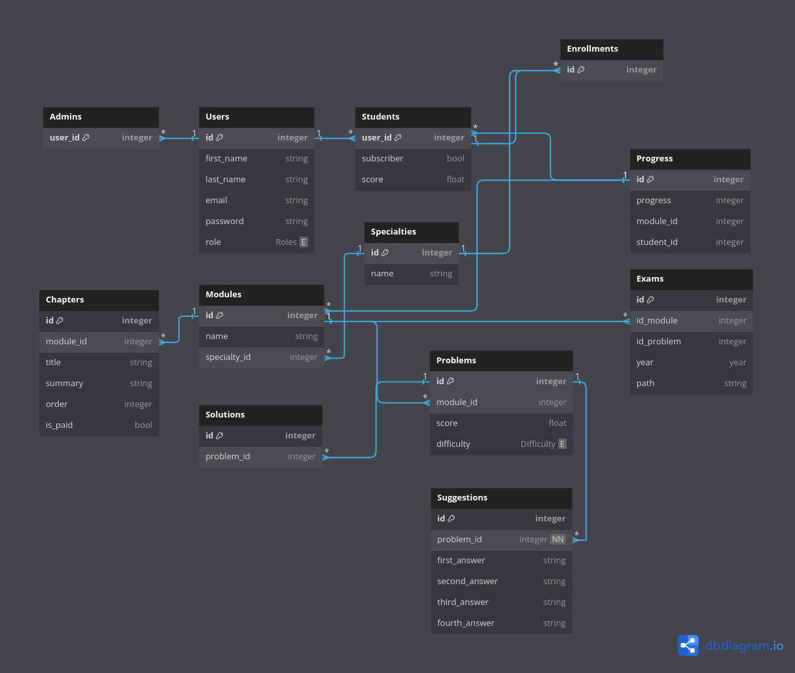

# nestBackend

## The Database Design

for now am trying to implement this unfinished Database schema .

the reason the DB came to what it is, is that I have used concepts that I have wrote about in other repositories such as [Multiple Table Inheritance](https://github.com/eDyrr/Single-Table-Inheritance-VS-Multiple-Table-Inheritance) and [Attribute Based Access Control](https://github.com/eDyrr/ABAC-vs-RBAC).

## The folder structure

obviously each table has its own folder (this step is currently unfinished).